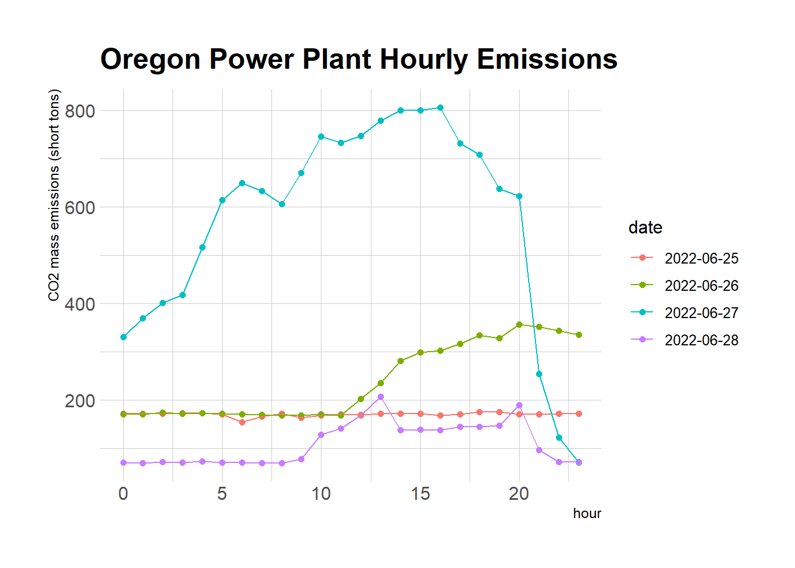

EPA-CleanAirMarkets Hourly Emissions API Connection
================
Hans Elliott
8/11/2022

``` r
library(pacman)
pacman::p_load(dplyr, jsonlite, httr, ggplot2)
```

Source - Clean Air Markets Division data API: <https://campd.epa.gov/>

``` r
# Extract data from API
base_url = "https://api.epa.gov/easey/streaming-services/emissions/apportioned/hourly?"
api_key = paste0("&api_key=",Sys.getenv("EPA_CAM_APIKEY"))
query1 = "stateCode=OR&unitType=Arch-fired%20boiler|Bubbling%20fluidized%20bed%20boiler|Cyclone%20boiler|Cell%20burner%20boiler|Combined%20cycle|Circulating%20fluidized%20bed%20boiler|Combustion%20turbine|Dry%20bottom%20wall-fired%20boiler|Dry%20bottom%20turbo-fired%20boiler|Dry%20bottom%20vertically-fired%20boiler|Internal%20combustion%20engine|Integrated%20gasification%20combined%20cycle|Cement%20Kiln|Other%20boiler|Other%20turbine|Pressurized%20fluidized%20bed%20boiler|Process%20Heater|Stoker|Tangentially-fired|Wet%20bottom%20wall-fired%20boiler|Wet%20bottom%20turbo-fired%20boiler|Wet%20bottom%20vertically-fired%20boiler&unitFuelType=Coal|Coal%20Refuse|Diesel%20Oil|Liquified%20Petroleum%20Gas|Natural%20Gas|Other%20Gas|Other%20Oil|Other%20Solid%20Fuel|Petroleum%20Coke|Pipeline%20Natural%20Gas|Process%20Gas|Process%20Sludge|Refuse|Residual%20Oil|Tire%20Derived%20Fuel|Waste%20Liquid|Wood&controlTechnologies=Additives%20to%20Enhance%20PAC%20and%20Existing%20Equipment%20Performance|Ammonia%20Injection|Baghouse|Catalyst%20%28gold%2C%20palladium%2C%20or%20other%29%20used%20to%20oxidize%20mercury|Combustion%20Modification%2FFuel%20Reburning|Cyclone|Dry%20Lime%20FGD|Dry%20Low%20NOx%20Burners|Dry%20Sorbent%20Injection|Dual%20Alkali|Electrostatic%20Precipitator|Fluidized%20Bed%20Limestone%20Injection|Halogenated%20PAC%20Sorbent%20Injection|Hybrid%20ESP|Low%20NOx%20Burner%20Technology%20%28Dry%20Bottom%20only%29|Low%20NOx%20Burner%20Technology%20w%2F%20Closed-coupled%20OFA|Low%20NOx%20Burner%20Technology%20w%2F%20Closed-coupled%2FSeparated%20OFA|Low%20NOx%20Burner%20Technology%20w%2F%20Overfire%20Air|Low%20NOx%20Burner%20Technology%20w%2F%20Separated%20OFA|Low%20NOx%20Cell%20Burner|Magnesium%20Oxide|Other|Other%20%28Non%20PAC%29%20Sorbent%20Injection|Overfire%20Air|Regenerative%20Activated%20Coke%20Technology|Selective%20Catalytic%20Reduction|Selective%20Non-catalytic%20Reduction|Sodium%20Based|Steam%20Injection|Untreated%20PAC%20Sorbent%20Injection|Water%20Injection|Wet%20ESP|Wet%20Lime%20FGD|Wet%20Limestone|Wet%20Scrubber&programCodeInfo=ARP|CAIRNOX|CAIROS|CAIRSO2|CSNOX|CSNOXOS|CSOSG1|CSOSG2|CSOSG3|CSSO2G1|CSSO2G2|NBP|NHNOX|NSPS4T|OTC|RGGI|SIPNOX|TXSO2&beginDate=2022-06-25&endDate=2022-06-28&operatingHoursOnly=false&exclude=hgControlInfo"

hourly_emis = httr::GET(paste0(base_url, query1, api_key),
                        )
hourly_emis = hourly_emis %>% 
  httr::content(as = "text") %>% 
  jsonlite::fromJSON()

#Dimensions
dim(hourly_emis)
```

    ## [1] 1344   30

``` r
#Missing Values
colSums(is.na(hourly_emis))
```

    ##         stateCode      facilityName        facilityId            unitId 
    ##                 0                 0                 0                 0 
    ##  associatedStacks              date              hour            opTime 
    ##              1344                 0                 0                 0 
    ##         grossLoad         steamLoad           so2Mass so2MassMeasureFlg 
    ##              1024              1344              1024              1024 
    ##           so2Rate so2RateMeasureFlg           co2Mass co2MassMeasureFlg 
    ##              1024              1024              1024              1024 
    ##           co2Rate co2RateMeasureFlg           noxMass noxMassMeasureFlg 
    ##              1024              1024              1024              1024 
    ##           noxRate noxRateMeasureFlg         heatInput   primaryFuelInfo 
    ##              1024              1024              1024                 0 
    ## secondaryFuelInfo          unitType    so2ControlInfo    noxControlInfo 
    ##              1248                 0              1344                 0 
    ##     pmControlInfo   programCodeInfo 
    ##              1344                 0

``` r
# Look into CO2
or_co2 = hourly_emis %>%
  # Data is only available for times when measurement is active
  mutate(co2RateMeasureFlg = ifelse(co2RateMeasureFlg=="Calculated", 1, 0),
         co2MassMeasureFlg = ifelse(co2MassMeasureFlg=="Measured", 1, 0)) %>%
  # Select desired cols
  select(stateCode, facilityName, facilityId, unitId, date, hour, opTime,
         grossLoad, co2Mass, co2MassMeasureFlg, co2Rate, co2RateMeasureFlg,
         primaryFuelInfo, unitType)


or_co2 %>% filter(co2MassMeasureFlg==1) %>%
  group_by(hour, date) %>%
  mutate(tot_co2Mass = sum(co2Mass, na.rm = TRUE)) %>%
  ggplot(aes(x = hour, y = tot_co2Mass, color = date)) +
  geom_point() +
  geom_line() +
  hrbrthemes::theme_ipsum() +
  labs(y = "CO2 mass emissions (short tons)", 
       title = "Oregon Power Plant Hourly Emissions")
```

<!-- -->

``` r
or_co2 %>% filter(co2RateMeasureFlg==1) %>%
  group_by(hour, date) %>%
  mutate(avg_co2Rate = mean(co2Rate, na.rm = TRUE)) %>%
  ggplot(aes(x = hour, y = avg_co2Rate, color = date), alpha=0.5) +
  geom_point() + 
  geom_line() +
  labs(title = "Average CO2 hourly emissions rate", y = "short tons/mmBtu") +
  hrbrthemes::theme_ipsum()
```

<!-- -->
